# The Hive Roadmap

This is the canonical end-to-end roadmap for The Hive. It records durable
milestones from the documented project start to the planned documentation
end-state; it does not establish runtime, provider, installation, deployment,
release, or service availability.

```mermaid
flowchart LR
  M1["2026-06-07: local tmux MCP controller"] --> M2["The Hive local control-plane foundation"]
  M2 --> M3["Source/test coordination foundation — Hier sind wir"]
  M3 --> M4["Geplant: provider capacity and model routing"]
  M4 --> M5["Geplant: topic bus, archive, and resume"]
  M5 --> M6["Geplant: remote leadership, control, and fleet surfaces"]
  M6 --> M7["Geplant: diagnostics and Google inventory"]
  M7 --> M8["Geplant: decision projection and CourseGuard"]
  M8 --> M9["Geplant: verified provenance, path cutover, and guide publication"]
```

Textalternative: lokaler tmux-MCP-Controller → The-Hive-Control-Plane-Fundament
→ source-/testgestützte Koordinationsgrundlage → geplante Kapazitäts- und
Modellsteuerung → geplanter Topic-Bus mit Archiv und Resume → geplante Remote-
Leitung und Flottenoberflächen → geplante Diagnostik und Google-Inventar →
geplante Entscheidungsprojektion und CourseGuard → geplante geprüfte
Provenienz, Pfadbereinigung und stabilisierte Anleitungsveröffentlichung.

## Meilenstein 1: Projektanfang

Am 2026-06-07 ist ein lokaler tmux-MCP-Controller für Codex-Agenten als
belegter Projektanfang dokumentiert.

## Meilenstein 2: The-Hive-Control-Plane-Fundament

Die dauerhafte The-Hive- und Local-Control-Plane-Grundlage bildet die Basis
für die nachfolgenden Produktbereiche.

## Meilenstein 3: Source- und Test-Koordinationsgrundlage

Die belegte Koordinationsgrundlage umfasst ausschließlich source-integrierte
BUS-S1/A- und BUS-S1/B-Artefakte sowie zugehörige Tests. Daraus folgt kein
Broker, Consumer, Transport, Service, Deployment oder Laufzeitbetrieb.

## Meilenstein 4: Providerkapazität und Modellrouting (geplant)

Geplant sind dynamischer Accountpool und Home-Lifecycle, Resource Admission
mit htop-/Telemetriebezug sowie providerübergreifende Kapazitäts-,
Modellrouting- und Cachebetrachtung einschließlich Gemini/Vertex. Siehe
[Providerkapazität und Modellrouting](docs/provider-capacity-and-model-routing.md).

## Meilenstein 5: Topic-Bus, Archiv und Resume (geplant)

Geplant sind ein dauerhafter Topic-Bus mit Archiv- und Resume-Grenzen für die
Koordination. Siehe [Hive-Bus und Resume](docs/hive-bus-and-resume.md).

## Meilenstein 6: Remote-Leitung, Control und Flotte (geplant)

Geplant sind Remote-Leitung, ein Control-/Execution-Host sowie
Flottenoberflächen. Siehe
[Remote Control und Flotte](docs/remote-control-and-fleet.md).

## Meilenstein 7: Diagnostik und Google-Inventar (geplant)

Geplant sind diagnostische Oberflächen und ein Google-Inventar-Helper. Siehe
[Google-Inventar und Diagnostik](docs/google-inventory-and-diagnostics.md).

## Meilenstein 8: Entscheidungsprojektion und CourseGuard (geplant)

Geplant sind Entscheidungsprojektion und CourseGuard als getrennte
Fachbereiche. Siehe [Entscheidungsprojektion](docs/decision-projection.md)
und [CourseGuard](docs/courseguard.md).

## Meilenstein 9: Geprüfte Provenienz und Anleitungsveröffentlichung (geplant)

Der planbelegte Endzustand umfasst geprüfte und freigegebene Fachpfade,
bereinigte Altpfade sowie stabilisierte veröffentlichte Anleitungen. Er ist
geplant und kein Nachweis einer bereits erfolgten Umstellung.
